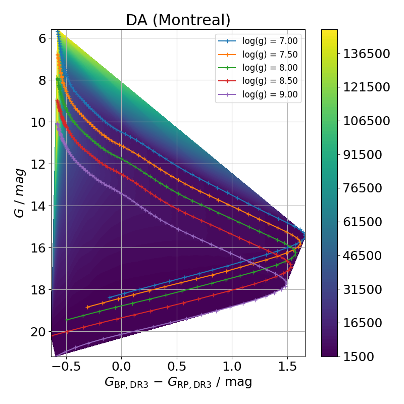

======================
White Dwarf Atmosphere
======================

The only synthetic photometry publicly available over a smooth grid of wide ranges of temperature and surface gravity is the `Montreal model <https://www.astro.umontreal.ca/~bergeron/CoolingModels/>`_. The tables are provided with bolometric and absolute magnitudes on various photometric systems in pure hydrogen (DA) and pure-helium (DB) in the range of :math:`\log(g)=7.0 - 9.0`, as well as the effective temperature and total cooling time (though this grid is sparse compared to their complementary cooling model grids). These include the Johnson-Kron-Cousins (:math:`U, B, V, R \& I`), Two Micron All Sky Survey (2MASS) :math:`J, H \& K_{s}`, Mauna Kea Observatory (MKO) :math:`Y, J, H \& K`, Wide-field Infrared Survey Explorer (WISE) :math:`W1, W2, W3 \& W4`, Spitzer Space Telescope Infrared Array Camera (IRAC) :math:`[3.6], [4.5], [5.8] \& [8.0]` :math:`\mu m`, Sloan Digital Sky Survey (SDSS) :math:`u, g, r, i \& z`, Panoramic Survey Telescope and Rapid Response System (Pan-STARRS 1) g, r, i, z & y, Gaia :math:`G, G_{\mathrm{BP}}\,\&\,G_{\mathrm{RP}}`, and Galaxy Evolution Explorer (GALEX) :math:`FUV` and :math:`NUV`.

The stellar masses and cooling ages are based on the latest generation of evolutionary sequences (`Bedard et al. 2020 <https://ui.adsabs.harvard.edu/abs/2020ApJ...901...93B/abstract>`_). The choice of thick (:math:`q_H \equiv \frac{\mathcal{M}_H}{\mathcal{M}*} = 10^{-4}`) and thin (:math:`q_H = 10^{-10}`) hydrogen layers for the pure-hydrogen and pure-helium model atmospheres, respectively. Details of the colour calculations are described in `Bergeron, Wesemael \& Beauchamp 1995 <https://ui.adsabs.harvard.edu/abs/1995PASP..107.1047B/abstract>`_ and `Holberg \& Bergeron 2006 <https://ui.adsabs.harvard.edu/abs/2006AJ....132.1221H/abstract>`_. The DA grid covers a temperature range :math:`T_{\mathrm{eff}} = 2\,500 - 150\,000` K while the DB grid covers :math:`T_{\mathrm{eff}} = 3\,250 - 150\,000` K. Both model are computed with surface gravities :math:`\log(g) = 7.0 - 9.0` (`Blouin, Dufour \& Allard 2018 <https://ui.adsabs.harvard.edu/abs/2018ApJ...863..184B/abstract>`_, `Bedard, Bergeron, Brassard \& Fontaine 2020 <https://ui.adsabs.harvard.edu/abs/2020ApJ...901...93B/abstract>`_, `Tremblay, Bergeron \& Gianninas 2011 <https://ui.adsabs.harvard.edu/abs/2011ApJ...730..128T/abstract>`_, `Bergeron et al. 2011 <https://ui.adsabs.harvard.edu/abs/2011ApJ...737...28B/abstract>`_, `Kowalski \& Saumon 2006 <https://ui.adsabs.harvard.edu/abs/2006ApJ...651L.137K/abstract>`_). See below for the cooling models at different surface gravities.

