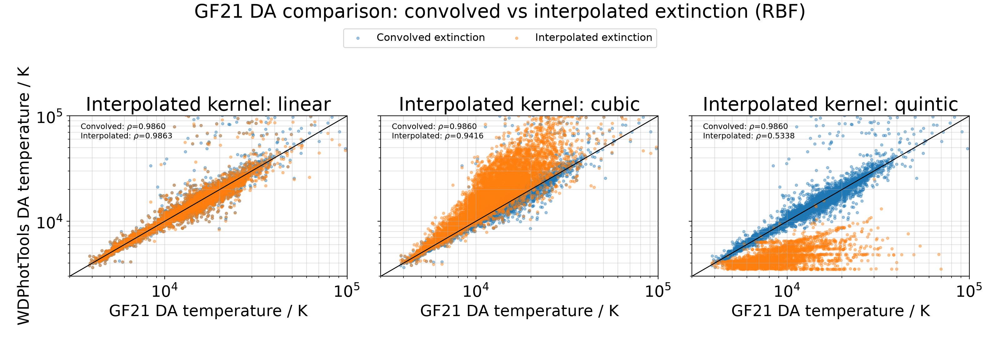
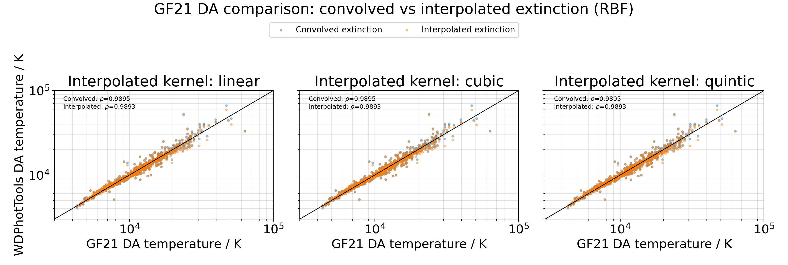

=================================
Interpolation Scheme Diagnostics
=================================

The ``kernel`` argument used with ``extinction_convolved=False`` selects the
radial-basis interpolation scheme for the tabulated reddening profile. The
available ``linear``, ``cubic``, and ``quintic`` kernels are useful numerical
approximations. They do not make pivot-wavelength extinction equivalent to
filter-by-filter extinction convolution.

Higher-order kernels need particular care. Cubic and quintic kernels introduce
more curvature into the fitted surface than the linear kernel. Combined with a
non-linear photometric fit, this can make a poor starting point converge to a
different local minimum.

Fixed Starting Point Diagnostic
===============================

The diagnostic below fitted 10,000 extinction-stratified GF21 DA candidates
with a fixed initial point of ``(Teff, logg) = (10000 K, 8.0)``. Each panel
compares a convolved-extinction fit with an interpolated-extinction fit using
the named RBF kernel. The linear result follows the reference relation closely.
The cubic result has a broader high-temperature branch and the quintic result
has a pronounced low-temperature branch. Their reported Pearson correlations
with the GF21 temperatures are 0.9416 and 0.5338, respectively, compared with
0.9863 for the linear fit.

   Fixed-start RBF diagnostic. Cubic and quintic interpolated fits can select
   erroneous solution branches when fitting starts far from the best solution.

This diagnostic is a failure-mode check, not a measurement of a kernel-only
effect. High-order RBF profile shape, sparse reddening-table sampling, and
optimizer initialization can all contribute. It does show that a single,
generic starting point is insufficient validation for cubic or quintic fits.

Multiple Starting Points
========================

For each source, use several physically plausible starting points and retain
the finite solution with the lowest :math:`\chi^2`. For example, the diagnostic
used ``(10000 K, 8.0)``, ``(25000 K, 7.0)``, and ``(70000 K, 8.0)``. This is a
deterministic multistart search, not posterior sampling.

The 1,000-source diagnostic below applies that procedure. The selected
solutions give closely matched temperature relations for the three kernels.
This does not prove that interpolated extinction is equivalent to convolved
extinction; it shows that the obvious incorrect local-minimum solutions were
removed before comparing interpolation schemes.

   RBF diagnostic after choosing the lowest finite :math:`\chi^2` solution from
   three starting points per source and kernel.

Recommended Practice
====================

* Prefer ``extinction_convolved=True`` for science results. It evaluates
  extinction through the model spectrum and passband.
* Treat ``extinction_convolved=False`` as a pivot-wavelength approximation.
* For cubic or quintic RBF kernels, evaluate multiple initial guesses and
  inspect both fitted parameters and :math:`\chi^2` before accepting a result.

