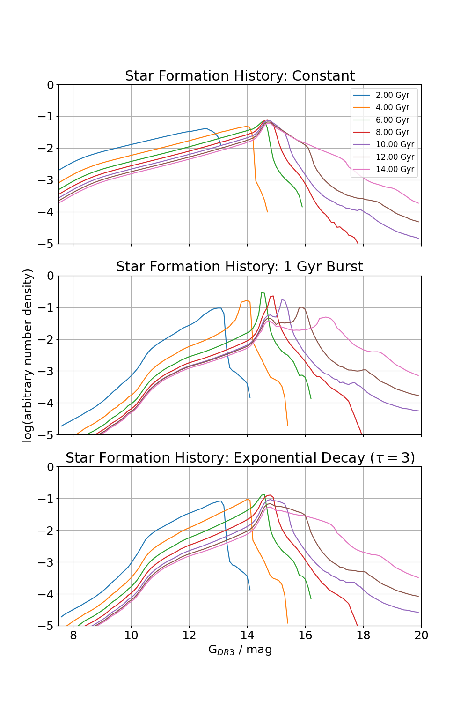

White Dwarf Luminosity function
===============================

WDLF is a common tool for deriving the age of a stellar population. A WDLF is the number density of WD as a function of luminosity, it is an evolving function with time. Its shape and normalisation determined from only a few parameters. `Winget et al. (1987) <https://ui.adsabs.harvard.edu/abs/1987ApJ...315L..77W/abstract>`_ compared an observed WDLF derived from the Luyten Half-Second (LHS) catalogue with a theoretical WDLF to obtain an estimate of the age of the Galaxy for the first time with this technique. `Noh \& Scalo (1990) <https://ui.adsabs.harvard.edu/abs/1990ApJ...352..605N/abstract>`_ examined WDLFs with various SFH scenarios. They showed that WDLF is a sensitive probe of the star formation history (SFH) as it shows signatures of irregularities in the SFH such as bursts and lulls. `Rowell (2013) <https://ui.adsabs.harvard.edu/abs/2013MNRAS.434.1549R/abstract>`_ took it further to address this inverse problem mathematically and showed some success in recovering the SFH of the solar neighbourhood when compared against SFH computed from other methods. By decomposing the disks and halo components of the Milky Way, we can have an independent view of the past star formation history revealed by only the WD populations, where they are most useful in deriving the SFH of old stellar populations (`Rowell \& Hambly 2011 <https://ui.adsabs.harvard.edu/abs/2011MNRAS.417...93R/abstract>`_, `Lam 2017 <https://ui.adsabs.harvard.edu/abs/2017ASPC..509...25L/abstract>`_).

The mathematical construction of a WDLF is intuitively straightforward: stars were formed in a distribution of mass (:math:`\mathcal{M}_i`), described by the initial mass function (IMF, :math:`\phi`). Then, they spend their lifetime carrying out nuclear burning (:math:`t_{\mathrm{MS}}`), the time they spend depends mainly on their mass. Towards the end stage of stellar evolution stars shed most of the atmosphere, which is modelled by the initial-final mass relation (IFMR, :math:`\zeta`). Once they have become WDs, all is left is to know how long it has been cooling (:math:`t_{\mathrm{cool}}`) in order to reach the current luminosity (:math:`M_\mathrm{bol}`). The heavy duty of these computations are coming from interpolation of pre-computed lookup tables. The important part of this work is to carefully interpolate and integrate over the model grids, because they are both susceptible to significant rounding errors given the huge dynamic ranges the variables cover. For example, in case of a simple star burst of :math:`\mathcal{O}(10^6)` yrs, it requires a relative error tolerance of :math:`10^{-10}` in order to integrate properly for an old population.

The integral for a WDLF when parameterised with bolometric magnitude (as
opposed to luminosity) can be written as

:math:`n(M_{\mathrm{bol}}) = \int_{\mathcal{M}_l}^{\mathcal{M}_u} \tau(M_\mathrm{bol}, \mathcal{M}_f) \psi(T_0, M_\mathrm{bol}, \mathcal{M}_i, m, Z) \phi(\mathcal{M}_i) d\mathcal{M}_i`

where :math:`n` is the number density, :math:`\tau` is the inverse cooling rate, :math:`\psi` is the relative star formation rate, :math:`\phi` is the initial mass function; and their dependent variables: :math:`M_\mathrm{bol}` is the absolute bolometric magnitude, :math:`\mathcal{M}_f` is the WD mass, :math:`T_0` is the look-back time, :math:`\mathcal{M}_i` is the progenitor MS mass, :math:`Z` is the metallicity, :math:`\mathcal{M}_l` is the minimum progenitor MS mass that could have singly evolved into a WD in the given time, and :math:`\mathcal{M}_u` is the maximum progenitor MS mass.

This is an example set of WDLFs in 3 forms of star formation history each at 7 different ages:

