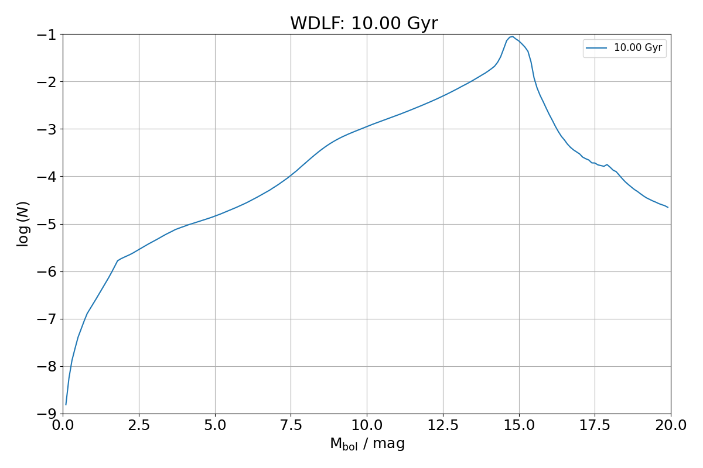

Generate WDLF
=============

To compute a WDLF, 5 models have to be specified (there are presets, so you don't have to explicitly specify them if you don't have to change from the default). After setting the cooling models, an explicit call (`compute_cooling_age_interpolator()`) is required to generate an interpolator to update the choice of cooling models. The following example shows how each of the model can be explicityly specified before computing the WDLF.

.. code:: python

    import numpy as np
    from WDPhotTools import theoretical_lf

    Mag = np.arange(0, 20.0, 0.1)

    wdlf = theoretical_lf.WDLF()

    # Set the cooling models
    wdlf.set_low_mass_cooling_model('montreal_co_da_20')
    wdlf.set_intermediate_mass_cooling_model('montreal_co_da_20')
    wdlf.set_high_mass_cooling_model('montreal_co_da_20')

    # Construct the interpolator
    wdlf.compute_cooling_age_interpolator()

    # Set the initial mass function to Kroupa 2001
    wdlf.set_imf_model("K01")

    # Use the PARSEC stellar evolution model with a metallicity of z=0.014
    wdlf.set_ms_model('PARSECz0014')

    # Use the Catalan et al. 2008 IFMR
    wdlf.set_ifmr_model("C08")

    # Constant SFR since 10 Gyr ago
    wdlf.set_sfr_model(mode="constant", age=1e10)

    # Compute the WDLF
    mag, constant_density = wdlf.compute_density(Mag=Mag)

    wdlf.plot_wdlf(
        display=True,
        folder=".",
        ext=["png", "pdf"],
        savefig=True,
    )

