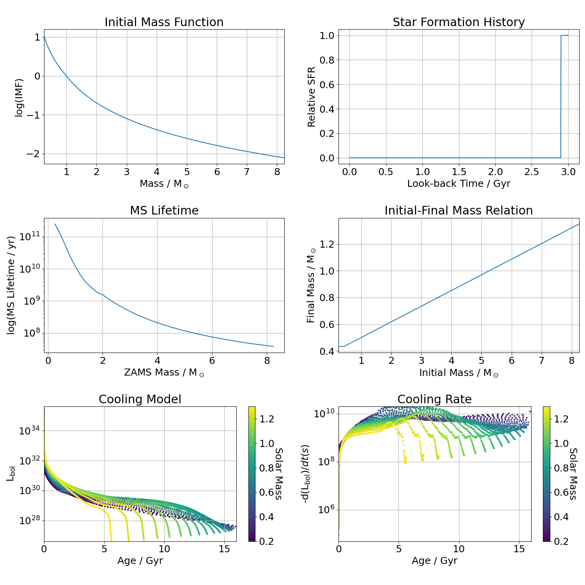

Model Plotting
==============

To inspect the Montreal atmosphere models, it can be done easily with the following lines. The following example plots the colour-magnitude diagram in the Gaia eDR3 filters. It can easily be changed to a colour-colour diagram by changing the `y="G3"` to, for example, `y="G3-GE_RP"`. The available parameters of the model can be retrieved with `plotter.list_atmosphere_parameters()`

.. code:: python

    from WDPhotTools import plotter

    plotter.plot_atmosphere_model(
        x="G3_BP-G3_RP",
        y="G3",
        atmosphere="H",
        invert_yaxis=True,
        savefig=True,
        folder=".",
        filename="DA_cooling_tracks_from_plotter",
        ext=['png', 'pdf'],
    )

.. figure:: ../_static/DA_cooling_tracks_from_plotter.png

In order to inspect the cooling models, it is slightly less straight forward because each model comes with different parameters. In the following example, we define the model to be `montreal_co_da_20` and plotting the cooling tracks at those 5 masses only. The names of the model can be retrieved with `plotter.list_cooling_model()`, while the model parameters can be found using `plotter.list_cooling_parameters(MODEL_NAME)`

.. code:: python

    from WDPhotTools import plotter

    plotter.plot_cooling_model(
        model="montreal_co_da_20",
        mass=[0.2, 0.4, 0.6, 0.8, 1.0],
        savefig=True,
        folder="example_output",
        filename="DA_cooling_model_from_plotter",
    )

.. figure:: ../_static/DA_cooling_model_from_plotter.png

A convenient diagnostic to inspect the input model is available with the `WDLF`, using the `plot_input_models` will dispaly a figure with 6 diagnostic subplots: the intial mass function, star formation history, total stellar evolution time, initial-final mass relation, cooling tracks and cooling rates.

.. code:: python

    import numpy as np
    from WDPhotTools import theoretical_lf

    wdlf = theoretical_lf.WDLF()

    Mag = np.arange(0, 20.0, 2.5)
    age = [3.0e9]
    wdlf.set_sfr_model(mode="burst", age=age[0], duration=1e8)
    wdlf.compute_cooling_age_interpolator()

    fig_input_models = wdlf.plot_input_models(
        cooling_model_use_mag=False,
        imf_log=True,
        display=True,
        folder=".",
        ext=["png", "pdf"],
        savefig=True,
    )

